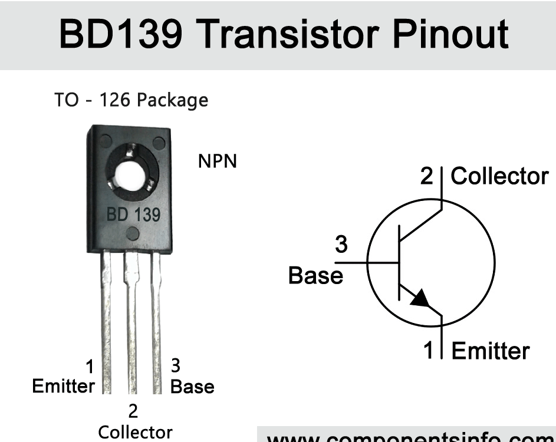
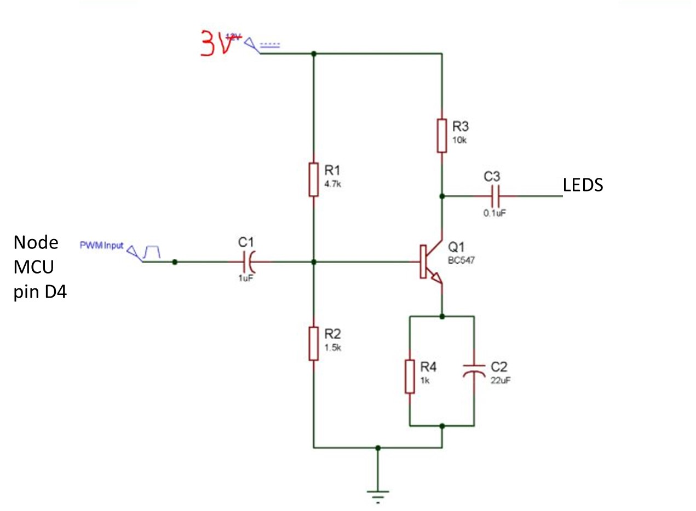
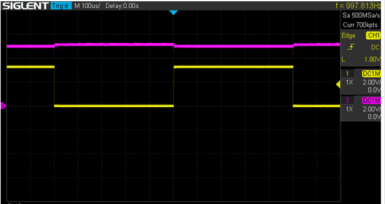
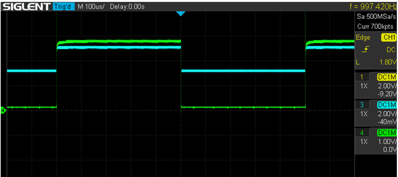
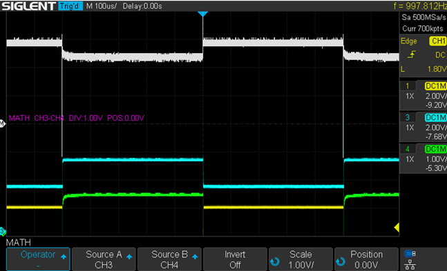

# Bowl with LEDS
Control the intensity of the LEDS via a NODEMCU with PWM and add it to Home Assistant

## Description and operation instructions
12Leds controlled via a dashboard in Home Assistant.

 ## Technical description
Calculate the value of the resistor in relation to the amount of LEDs. In this case 12 LEDs will be used with a forward voltage of 3.2 - 3.4V and a forward current of 20mA. 5V will be used as input as that is minimal required for the NodeMCU and can be powered via an USB charger.
The LEDs will be connected in parallel leaving the voltage over the resistor 5V - 3.3V = 1.7V. Take 12 LEDs multiplied by 20mA = max 240mA. The resistor will then be 1.7V / 240mA = ~8hm. As I did not have a 8 Ohm 0,5W I used a 12 Ohm 0,5W resistor. This also ensures that we are not operating at the edge. A BD139 is used as it needs to deal with 240mA where a BD547C can only deliver 100mA max.
Don't use D4 as it will give issues during boot. Use D5 of the NodeMCU instead.

### Parts
1 x NodeMCU


12 x 5mm white led
1 x 12 Ohm 0,5W resistor
1 x 1k resistor
1 x BD139 NPN transistor


### Schematic overview



### ESPHome installation
See the instructions https://github.com/Wilko01/ESPHome  (not listed here)


### ESPHome Configuration in Home Assistant
Create a new device  with this code:
```
#Running via ESPHOME

#Runs on a NodeMCU

esphome:
  name: bowl-leds

esp8266:
  board: nodemcuv2

# Enable logging
logger:

# Enable Home Assistant API
api:

ota:
  password: "1e7c9c2b1830d88364f40572c813b20f"

wifi:
  ssid: !secret wifi_ssid
  password: !secret wifi_password

  # Enable fallback hotspot (captive portal) in case wifi connection fails
  ap:
    ssid: "Bowl-Leds Fallback Hotspot"
    password: "7lgvJ8aOzZ3w"

captive_portal:

#begin code

output:
  - platform: esp8266_pwm
    pin: D5
    frequency: 1000 Hz
    id: pwm_output


fan:
  - platform: speed
    output: pwm_output
    name: "Bowl-LEDs"
#end code
```

### Interface
#### Home Assistant
Home Assistant is connected via the ESPHome integration.

##### card
Create a card in the dashboard of Home Assistant with this code
```
type: entities
entities:
  - fan.bowl_leds
```


### Testing
Turn the led on and off via the card at the dashboard

Scope values when the dim value in Home Assistant is set to 50%





### Information
- [PNP amplifier circuit](https://circuitdigest.com/electronic-circuits/transistor-as-an-amplifier-circuit)
- [ESPHOME PWM control](https://esphome.io/components/fan/speed.html)

Generic
- [Markdown Cheat Sheet](https://www.markdownguide.org/cheat-sheet/)


### Problems
During testing with the breadboard, the power used by the LEDs was way below the 20mA. This was mainly due to the bad connections of the breadboard. Once the connections were soldered, the problem was gone and the max current of the LEDs was almost reached.

### Wishlist
..


